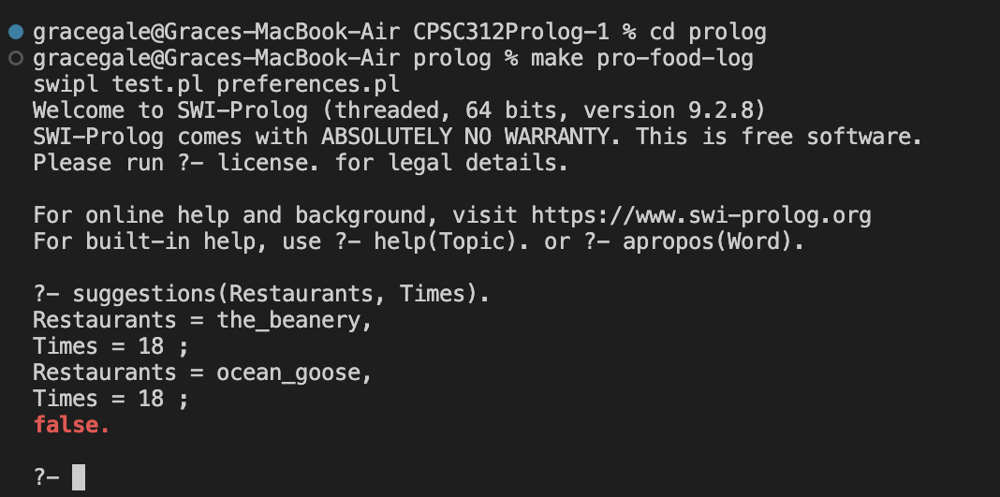
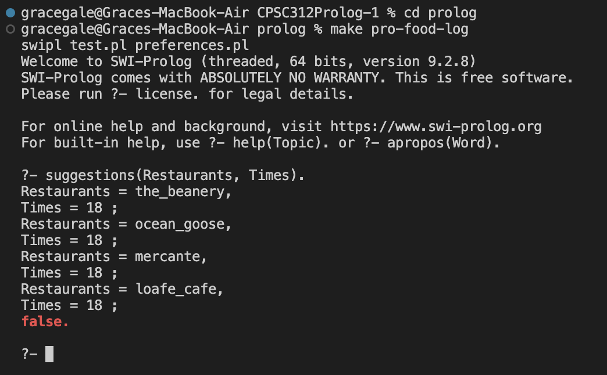

# CPSC 312 Project

# Pro-Food-Log™️: A restaurant picker for the indecisive

Imagine you're trying to plan a meetup with friends — everyone's schedules seem to line up, maybe you'll go grab food together… but there are still plenty of details left to sort out! Enter Pro-Food-Log™️, the tool designed to help you find a common time and place for a meal with friends!

This project is in fulfillment of the [CPSC 312 2024W1 project requirements](https://steven-wolfman.github.io/cpsc-312-website-2024W1/project.html).

## Team Members

Our team is:

+ Grace Gale (52524915): grayscale 🦭
+ Ivan Orozco Vasquez (29979267): Wazmo 👨‍🦯‍➡️
+ Kae Rene Boey (82279530): kay-othic 🧛‍♀️
+ Kyle Webster (68017623): Mr. Lizard 🦎
+ Sophia Schwandt (33428384): soapy 🍗

We call ourselves: Typeclass Clowns 🤡

## Acknowledgments

We surely built on the work of others! Here are resources and people we got support from:

ChatGPT (https://chatgpt.com/)
+ We used ChatGPT to get a sense of Prolog's full capabilities and to help us generate ideas for potential projects.  

CLPFD Library (https://www.swi-prolog.org/man/clpfd.html)
+ We plan to utilize SWI-Prolog's Constraint Logic Programming over Finite Domains (CLPFD) library.

Persistency Library (https://www.swi-prolog.org/pldoc/man?section=persistency)
+ We also plan to utilize SWI-Prolog's persistency library to allow users to save preferences in between sessions.

Google Maps [(UBC Campus)](https://www.google.com/maps/search/ubc+restaurants/@49.2623586,-123.2595266,14.57z?entry=ttu&g_ep=EgoyMDI0MTEwNi4wIKXMDSoASAFQAw%3D%3D)
+ We will use Google Maps to source restaurant recommendations and information such as location, opening hours, price range, and type of cuisine. 

## Product Pitch 

Planning a night out with friends can be a challenge, especially if everyone has competing schedules, preferences,
locations, and dietary restrictions. Pro-Food-Log will allow for smooth scheduling, ensuring that everyone's
unique needs are met.

Some group members may have limited availability. With Pro-Food-Log, each member of your group can provide their 
availability, and you will be recommended an ideal meeting time and a restaurant that can accommodate your group
size and timing. Your group members can also specify which types of cuisines they're in the mood for, and Pro-Food-Log will choose a restaurant that everyone will love. If some group members have accessibility needs or dietary restrictions, or need to bring along a child, Pro-Food-Log will account for this and pick a restaurant that 
satisfies everyone's needs. Depending on your group's preferences, Pro-Food-Log can find an expensive
restaurant for a luxurious night out, or a casual spot for a budget-friendly meal. Users will then be able to 
rate the restaurant options provided based on how well it fits their preference (e.g. 1 - does not spark joy, 
2 - neutral, 3 - sparks a lot of joy). 

Pro-Food-Log will have up-to-date information sourced from Google Maps. The graphical interface will display photos and
key information about the restaurants it suggests. Any number of friends can use Pro-Food-Log, and it can be used while
travelling to find restaurants anywhere in the world. 

## Minimal Viable Project
At this stage of the project timeline, our minimal viable project (MVP) will focus primarily on ensuring that the matching algorithm performs as expected for a small set of data. As such, the MVP will accommodate only 2 users, instead of an arbitrary number of users. Our system will leverage Prolog's pattern matching and scheduling abilities to create an algorithm that effectively determines the most appropriate date and eatery for 2 individuals to meet up at. Furthermore, we will use CLPFD in order to find a restaurant that satisfies all constraints and guest preferences as appropriate. In order to ensure a smooth(er) user experience, we plan to use the persistence library to store user preferences for ease of future use!

Additionally, user interactions will occur via the command line rather than a graphical user interface. However, to ensure the learning curve of our MVP isn't too steep, we will be using I/O commands to provide users with prompts which they can respond to. One final difference between our MVP and final product is that the range of available dates and restaurants will be pre-determined and limited in order to narrow the database. This allows us to test the matching algorithm on a smaller scale first, before attempting to apply it to a dynamic dataset.

** To run the MVP:**
1. Navigate to the `prolog` directory
2. Execute `make pro-food-log` in the terminal
3. Run the query `start.`
4. Follow the instructions prompted by the CLI

## Proof of Concept

Planning a successful restaurant outing requires coordination of time and location among participants. These key elements form the foundation of our proof of concept, which demonstrates a sample matching algorithm implemented in Prolog. The algorithm processes the participants involved, timing constraints, and restaurant data through logical rules.
Our current implementation lays the foundation for this matching algorithm, which can be easily adapted and extended to accommodate more users, restaurants, and preferences in the future. Prolog proves ideal for this application due to its strength in boolean logic and pattern matching, which align perfectly with our comparison-based matching system.

Users can input the [people](https://github.students.cs.ubc.ca/iorozco/CPSC312Prolog/blob/c7ad3b70386f348527d7a0eff7a927ebb366e6f5/prolog/preferences.pl#L9-L10) involved as well as the [restaurants](https://github.students.cs.ubc.ca/iorozco/CPSC312Prolog/blob/c7ad3b70386f348527d7a0eff7a927ebb366e6f5/prolog/test.pl#L39-L40) along with the time these restaurants are [open](https://github.students.cs.ubc.ca/iorozco/CPSC312Prolog/blob/c7ad3b70386f348527d7a0eff7a927ebb366e6f5/prolog/test.pl#L43-L44). [Restaurants meet the conditions](https://github.students.cs.ubc.ca/iorozco/CPSC312Prolog/blob/c7ad3b70386f348527d7a0eff7a927ebb366e6f5/prolog/test.pl#L51) if the open times match with the availability of the people involved.

Once all the information is input, you can search for restaurant [suggestions](https://github.students.cs.ubc.ca/iorozco/CPSC312Prolog/blob/c7ad3b70386f348527d7a0eff7a927ebb366e6f5/prolog/test.pl#L54) that will return restaurant names and times that work for everyone.

Future enhancements would demonstrate the algorithm's capability to handle larger groups while incorporating additional constraints such as dietary restrictions, allergies, and individual food preferences.

### How to test and run the code: Prolog

First, please ensure you have SWI-Prolog installed on your system. (If not, you can download it [here](https://www.swi-prolog.org/Download.html).)

To **run unit tests for our code**, execute one of the following:
- `make prolog-eval` from the project root directory
- `make test` from the `prolog` directory

To **interact with/run the proof of concept**
1. Navigate to the `prolog` directory
2. Execute `make pro-food-log` in the terminal

_note: This will load the personal preferences defined in [`preferences.pl`](prolog/preferences.pl) and the restaurants and algorithms in [`test.pl`](prolog/test.pl)._

**To get restaurant suggestions, run `suggestions(Restaurants,Times).` in the swipl repl created after executing `make pro-food-log`. Use `;` after each suggestion to get more suggestions until `false` is returned.**

Feel free to add more people and restaurants to the corresponding places in code!

 

**Proof of Concept Demonstration:**

 

**Proof of Concept with More Restaurants Added:**
